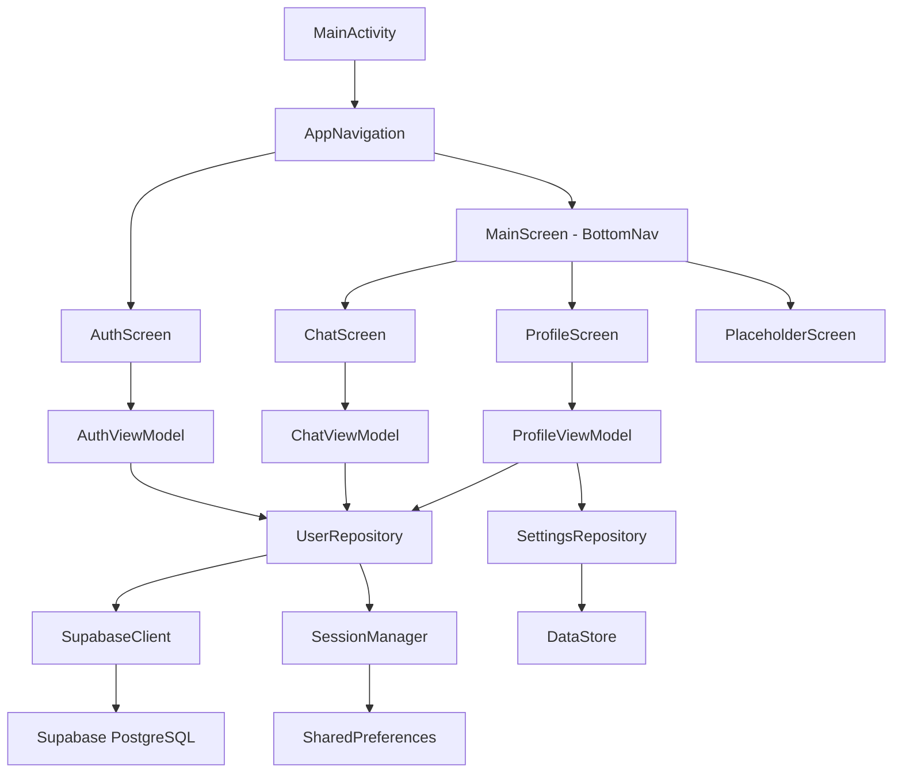
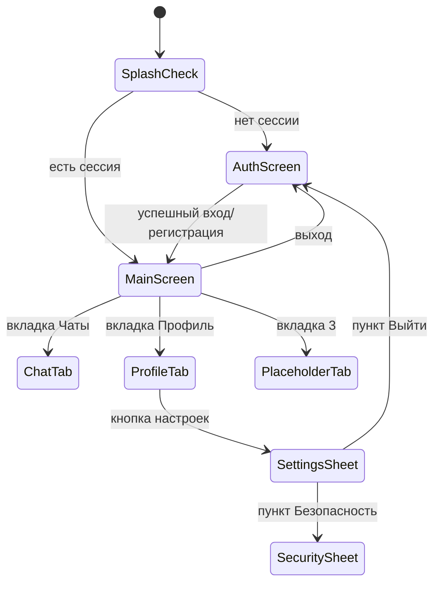

# Design Document: Android Chat App

## Обзор

Приложение представляет собой Android-клиент на Kotlin + Jetpack Compose, который позволяет пользователям:
- регистрироваться и авторизоваться через собственную таблицу `users` в Supabase PostgreSQL (без Supabase Auth);
- выбирать AI-ассистента и отправлять запросы через системное SMS-приложение;
- управлять профилем, настройками темы, AI по умолчанию и номером телефона.

Архитектура — MVVM + Repository pattern. Навигация — Bottom Navigation Bar с тремя вкладками.

---

## Архитектура

### Слои приложения

```
UI Layer (Compose Screens + ViewModels)
        ↓
Domain / Repository Layer
        ↓
Data Layer (Supabase Client + DataStore + SharedPreferences)
```

### Диаграмма компонентов



### Принятые архитектурные решения

- **MVVM**: ViewModel хранит UI-состояние через `StateFlow`, экраны подписываются через `collectAsState()`.
- **Repository pattern**: вся логика работы с данными инкапсулирована в репозиториях, ViewModel не знает об источниках данных.
- **Single Activity**: одна `MainActivity`, навигация через Compose Navigation.
- **Без Supabase Auth**: аутентификация реализована вручную через таблицу `users` с хешированием SHA-256.
- **RLS через anon key**: все запросы к Supabase выполняются с anon key; RLS-политики ограничивают доступ по `id`.

---

## Компоненты и интерфейсы

### SessionManager

Хранит `userId` текущего пользователя в `SharedPreferences`.

```kotlin
interface SessionManager {
    fun saveUserId(userId: String)
    fun getUserId(): String?
    fun clearSession()
    fun isLoggedIn(): Boolean
}
```

### PasswordHasher

```kotlin
object PasswordHasher {
    fun hash(password: String): String  // SHA-256, hex-строка
    fun verify(password: String, hash: String): Boolean
}
```

### UserRepository

```kotlin
interface UserRepository {
    suspend fun register(login: String, passwordHash: String, nickname: String, phone: String): Result<User>
    suspend fun login(phone: String, passwordHash: String): Result<User>
    suspend fun getUserById(id: String): Result<User>
    suspend fun updateUser(id: String, login: String?, nickname: String?, passwordHash: String?, vkId: String?): Result<Unit>
    suspend fun incrementRequestsCount(id: String): Result<Unit>
}
```

### SettingsRepository

Хранит настройки в `DataStore<Preferences>`.

```kotlin
interface SettingsRepository {
    val themeFlow: Flow<AppTheme>           // DARK | LIGHT | SYSTEM
    val defaultAiFlow: Flow<AiAssistant>    // CHATGPT | DEEPSEEK | QWEN | PERPLEXITY
    val smsPhoneFlow: Flow<String>          // один из двух номеров

    suspend fun setTheme(theme: AppTheme)
    suspend fun setDefaultAi(ai: AiAssistant)
    suspend fun setSmsPhone(phone: String)
}
```

### SmsLauncher

```kotlin
object SmsLauncher {
    fun launch(context: Context, phone: String, text: String)
    // Использует Intent(Intent.ACTION_SENDTO, Uri.parse("smsto:$phone"))
    // с extras EXTRA_SMS_BODY = text
}
```

### ViewModels

| ViewModel | Экран | Основные StateFlow |
|---|---|---|
| `AuthViewModel` | AuthScreen | `uiState: AuthUiState` |
| `ChatViewModel` | ChatScreen | `selectedAi`, `inputText`, `defaultAi` |
| `ProfileViewModel` | ProfileScreen | `user: User`, `avatarUri: Uri?` |
| `SettingsViewModel` | SettingsSheet | `theme`, `defaultAi`, `smsPhone` |

---

## Модели данных

### User (доменная модель)

```kotlin
data class User(
    val id: String,           // UUID
    val login: String,
    val nickname: String,
    val phone: String,
    val vkId: String?,
    val avatarUrl: String?,   // локальный URI или null
    val requestsCount: Int,
    val createdAt: String
)
```

### Таблица `users` в Supabase

| Столбец | Тип | Ограничения |
|---|---|---|
| `id` | uuid | PRIMARY KEY, default gen_random_uuid() |
| `login` | text | UNIQUE, NOT NULL |
| `password_hash` | text | NOT NULL |
| `nickname` | text | NOT NULL |
| `phone` | text | UNIQUE, NOT NULL |
| `vk_id` | text | nullable |
| `avatar_url` | text | nullable |
| `requests_count` | integer | default 0 |
| `created_at` | timestamptz | default now() |

### Перечисления

```kotlin
enum class AppTheme { DARK, LIGHT, SYSTEM }

enum class AiAssistant(val displayName: String, val phone: String) {
    CHATGPT("ChatGPT", ""),
    DEEPSEEK("DeepSeek", ""),
    QWEN("Qwen", ""),
    PERPLEXITY("Perplexity", "")
    // Номер SMS берётся из настроек, не из AI
}
```

### UI-состояния

```kotlin
sealed class AuthUiState {
    object Idle : AuthUiState()
    object Loading : AuthUiState()
    data class Error(val message: String) : AuthUiState()
    object Success : AuthUiState()
}
```

---

## Настройка Supabase

### 1. Создание проекта

1. Перейдите на [supabase.com](https://supabase.com) и создайте аккаунт.
2. Нажмите **New project**, укажите название, пароль базы данных и регион (выберите ближайший к пользователям).
3. Дождитесь инициализации проекта (1–2 минуты).

### 2. Создание таблицы `users`

Перейдите в **SQL Editor** и выполните:

```sql
CREATE TABLE public.users (
    id uuid PRIMARY KEY DEFAULT gen_random_uuid(),
    login text UNIQUE NOT NULL,
    password_hash text NOT NULL,
    nickname text NOT NULL,
    phone text UNIQUE NOT NULL,
    vk_id text,
    avatar_url text,
    requests_count integer DEFAULT 0,
    created_at timestamptz DEFAULT now()
);
```

### 3. Включение RLS и настройка политик

```sql
-- Включить RLS
ALTER TABLE public.users ENABLE ROW LEVEL SECURITY;

-- Политика: разрешить вставку новых пользователей без аутентификации (регистрация)
CREATE POLICY "allow_insert_anon"
ON public.users
FOR INSERT
TO anon
WITH CHECK (true);

-- Политика: пользователь может читать только свою строку
-- Используем кастомный заголовок x-user-id, который приложение передаёт в запросах
CREATE POLICY "allow_select_own"
ON public.users
FOR SELECT
TO anon
USING (id::text = current_setting('request.headers', true)::json->>'x-user-id');

-- Политика: пользователь может обновлять только свою строку
CREATE POLICY "allow_update_own"
ON public.users
FOR UPDATE
TO anon
USING (id::text = current_setting('request.headers', true)::json->>'x-user-id')
WITH CHECK (id::text = current_setting('request.headers', true)::json->>'x-user-id');
```

> Примечание: поскольку приложение не использует Supabase Auth (JWT), идентификация пользователя при SELECT/UPDATE выполняется через кастомный заголовок `x-user-id`, который `UserRepository` добавляет к каждому запросу после входа.

### 4. Получение anon key и URL проекта

1. В панели Supabase перейдите в **Project Settings → API**.
2. Скопируйте **Project URL** (вида `https://xxxx.supabase.co`).
3. Скопируйте **anon public** ключ.
4. Добавьте их в `local.properties` (не коммитить в git):

```properties
SUPABASE_URL=https://xxxx.supabase.co
SUPABASE_ANON_KEY=eyJhbGciOiJIUzI1NiIsInR5cCI6IkpXVCJ9...
```

5. В `build.gradle.kts` добавьте в `defaultConfig`:

```kotlin
buildConfigField("String", "SUPABASE_URL", "\"${properties["SUPABASE_URL"]}\"")
buildConfigField("String", "SUPABASE_ANON_KEY", "\"${properties["SUPABASE_ANON_KEY"]}\"")
```

### 5. Зависимости Supabase для Android

В `libs.versions.toml`:

```toml
[versions]
supabase = "3.1.4"
ktor = "3.1.3"

[libraries]
supabase-postgrest = { group = "io.github.jan-tennermann.supabase-kt", name = "postgrest-kt", version.ref = "supabase" }
supabase-gotrue = { group = "io.github.jan-tennermann.supabase-kt", name = "gotrue-kt", version.ref = "supabase" }
ktor-android = { group = "io.ktor", name = "ktor-client-android", version.ref = "ktor" }
```

В `app/build.gradle.kts`:

```kotlin
implementation(libs.supabase.postgrest)
implementation(libs.ktor.android)
```

### 6. Инициализация клиента

```kotlin
// SupabaseModule.kt (или Application class)
val supabase = createSupabaseClient(
    supabaseUrl = BuildConfig.SUPABASE_URL,
    supabaseKey = BuildConfig.SUPABASE_ANON_KEY
) {
    install(Postgrest)
}
```

---

## Навигация



Bottom Navigation Bar содержит три вкладки:
- **Чаты** (иконка: chat bubble)
- **Профиль** (иконка: person)
- **Скоро** (иконка: hourglass или star)

---

## Обработка ошибок

| Сценарий | Обработка |
|---|---|
| Логин уже занят при регистрации | `AuthUiState.Error("Логин уже занят")` |
| Телефон уже зарегистрирован | `AuthUiState.Error("Номер телефона уже зарегистрирован")` |
| Неверный телефон/пароль при входе | `AuthUiState.Error("Неверный номер телефона или пароль")` |
| Пустые поля формы | Валидация на уровне ViewModel до отправки запроса |
| Ошибка сети / Supabase недоступен | `AuthUiState.Error("Ошибка сети. Проверьте подключение")` |
| Логин уже занят при обновлении | `SecurityUiState.Error("Логин уже занят")` |
| Пустой логин/никнейм при обновлении | `SecurityUiState.Error("Поле не может быть пустым")` |

Все ошибки отображаются через `Snackbar` или текст под полем ввода. ViewModel сбрасывает состояние ошибки после отображения.

---

## Стратегия тестирования

### Подход

Используется двойная стратегия: **unit-тесты** для конкретных примеров и граничных случаев, **property-based тесты** для универсальных свойств.

### Библиотеки

- **Unit-тесты**: JUnit 4 + Mockk + Kotlin Coroutines Test
- **Property-based тесты**: [Kotest](https://kotest.io/) с модулем `kotest-property` (минимум 100 итераций на каждый тест)

### Unit-тесты

- `PasswordHasherTest`: проверка хеширования и верификации конкретных строк
- `AuthViewModelTest`: проверка переходов состояний при успехе/ошибке
- `SettingsRepositoryTest`: проверка сохранения и чтения настроек из DataStore
- `SmsLauncherTest`: проверка корректности формирования Intent

### Property-based тесты

Каждый тест помечен тегом в формате:
`Feature: android-chat-app, Property N: <текст свойства>`

Конфигурация Kotest:

```kotlin
// В build.gradle.kts
testImplementation("io.kotest:kotest-runner-junit5:<version>")
testImplementation("io.kotest:kotest-property:<version>")
```


---

## Correctness Properties

*Свойство (property) — это характеристика или поведение, которое должно выполняться при всех допустимых выполнениях системы. Это формальное утверждение о том, что система должна делать. Свойства служат мостом между читаемыми человеком спецификациями и машинно-верифицируемыми гарантиями корректности.*

---

### Property 1: Хеширование пароля — round-trip

*Для любого* непустого пароля: результат `hash(password)` не равен исходному паролю, и `verify(password, hash(password))` возвращает `true`. Кроме того, `verify(otherPassword, hash(password))` возвращает `false`, если `otherPassword != password`.

**Validates: Requirements 1.6, 1.2, 2.2, 7.4**

---

### Property 2: Уникальность логина при регистрации и обновлении

*Для любых* двух попыток создать или обновить пользователя с одинаковым логином: вторая операция должна завершиться ошибкой с сообщением "Логин уже занят", а данные первого пользователя остаются неизменными.

**Validates: Requirements 1.3, 7.2, 7.3**

---

### Property 3: Уникальность номера телефона при регистрации

*Для любых* двух попыток зарегистрировать пользователей с одинаковым номером телефона: вторая попытка должна завершиться ошибкой с сообщением "Номер телефона уже зарегистрирован".

**Validates: Requirements 1.4**

---

### Property 4: Сессия сохраняется после успешной аутентификации

*Для любого* успешного входа или регистрации: `SessionManager.getUserId()` должен возвращать `id` аутентифицированного пользователя, а `SessionManager.isLoggedIn()` — `true`.

**Validates: Requirements 1.5, 2.4**

---

### Property 5: Выход очищает сессию — round-trip

*Для любого* состояния, в котором `SessionManager` содержит `userId`: после вызова `clearSession()` метод `getUserId()` должен возвращать `null`, а `isLoggedIn()` — `false`.

**Validates: Requirements 3.2**

---

### Property 6: Навигация определяется состоянием сессии

*Для любого* состояния `SessionManager`: если `isLoggedIn() == true`, то стартовый маршрут навигации — `MainScreen`; если `isLoggedIn() == false`, то стартовый маршрут — `AuthScreen`. Navigator недоступен без активной сессии.

**Validates: Requirements 2.5, 2.6, 3.1**

---

### Property 7: Валидация пустых обязательных полей

*Для любой* формы (регистрация, вход, обновление данных), в которой хотя бы одно обязательное поле содержит пустую строку или строку из одних пробелов: функция валидации должна возвращать ошибку, и запрос к репозиторию не должен выполняться.

**Validates: Requirements 1.7, 4.5, 7.6**

---

### Property 8: Неверные учётные данные при входе возвращают ошибку

*Для любой* пары (телефон, пароль), которая не соответствует ни одной записи в системе: `UserRepository.login()` должен возвращать `Result.failure` с сообщением "Неверный номер телефона или пароль".

**Validates: Requirements 2.3**

---

### Property 9: Выбор AI обновляет состояние ViewModel

*Для любого* значения из `AiAssistant`: после вызова `ChatViewModel.selectAi(ai)` поле `selectedAi` в состоянии ViewModel должно быть равно выбранному значению.

**Validates: Requirements 4.2**

---

### Property 10: SmsLauncher формирует корректный Intent

*Для любого* непустого текста запроса и любого номера телефона: `SmsLauncher` должен формировать Intent с action `ACTION_SENDTO`, URI вида `smsto:<phone>` и телом сообщения, равным переданному тексту.

**Validates: Requirements 4.4, 4.7**

---

### Property 11: Счётчик запросов увеличивается ровно на 1

*Для любого* пользователя с произвольным начальным значением `requests_count`: после вызова `UserRepository.incrementRequestsCount(id)` значение счётчика должно увеличиться ровно на 1.

**Validates: Requirements 4.8**

---

### Property 12: Настройки сохраняются и читаются корректно — round-trip

*Для любого* допустимого значения настройки (тема, AI по умолчанию, номер телефона): после вызова соответствующего метода `set*()` в `SettingsRepository` последующее чтение через `Flow` должно вернуть то же самое значение.

**Validates: Requirements 6.2, 6.4, 6.6**

---

### Property 13: Аватарка сохраняется локально — round-trip

*Для любого* URI изображения из галереи: после обновления аватарки через `ProfileViewModel.updateAvatar(uri)` поле `avatarUri` в состоянии ViewModel должно содержать переданный URI.

**Validates: Requirements 5.3**

---

## Стратегия тестирования

### Подход

Используется двойная стратегия: **unit-тесты** для конкретных примеров и граничных случаев, **property-based тесты** для универсальных свойств. Оба типа дополняют друг друга.

### Библиотеки

- **Unit-тесты**: JUnit 4 + Mockk + `kotlinx-coroutines-test`
- **Property-based тесты**: [Kotest](https://kotest.io/) с модулем `kotest-property`
  - Минимум **100 итераций** на каждый property-тест
  - Каждый тест помечен тегом: `Feature: android-chat-app, Property N: <текст свойства>`

### Зависимости для тестирования

```toml
# libs.versions.toml
[versions]
kotest = "5.9.1"
mockk = "1.13.12"
coroutines-test = "1.8.1"

[libraries]
kotest-runner = { group = "io.kotest", name = "kotest-runner-junit5", version.ref = "kotest" }
kotest-property = { group = "io.kotest", name = "kotest-property", version.ref = "kotest" }
mockk = { group = "io.mockk", name = "mockk", version.ref = "mockk" }
coroutines-test = { group = "org.jetbrains.kotlinx", name = "kotlinx-coroutines-test", version.ref = "coroutines-test" }
```

### Unit-тесты (примеры и граничные случаи)

| Тест | Что проверяет |
|---|---|
| `AuthViewModelTest` | Переходы состояний: Idle → Loading → Success/Error |
| `PasswordHasherTest` | Хеш конкретных строк, верификация |
| `SessionManagerTest` | Сохранение, чтение, очистка сессии |
| `SettingsRepositoryTest` | Дефолтные значения при первом запуске |
| `SmsLauncherTest` | Корректность URI и тела Intent |
| `ChatViewModelTest` | Блокировка кнопки при пустом тексте, AI по умолчанию |

### Property-based тесты

Каждое свойство из раздела "Correctness Properties" реализуется одним property-тестом:

```kotlin
// Пример: Property 1 — хеширование пароля
class PasswordHasherPropertyTest : StringSpec({
    // Feature: android-chat-app, Property 1: Хеширование пароля — round-trip
    "for any non-empty password, hash is not equal to original and verify returns true" {
        checkAll(100, Arb.string(1..50)) { password ->
            val hash = PasswordHasher.hash(password)
            hash shouldNotBe password
            PasswordHasher.verify(password, hash) shouldBe true
        }
    }
})

// Пример: Property 7 — валидация пустых полей
class ValidationPropertyTest : StringSpec({
    // Feature: android-chat-app, Property 7: Валидация пустых обязательных полей
    "for any form with at least one blank field, validation returns error" {
        checkAll(100, Arb.string().filter { it.isBlank() }) { blankField ->
            validateRegistrationForm(
                login = blankField, password = "pass", nickname = "nick", phone = "79001234567"
            ).isFailure shouldBe true
        }
    }
})
```

### Интеграционные тесты

- Тестирование `UserRepository` с реальным Supabase (тестовый проект) или с mock-клиентом
- Проверка RLS-политик: попытка читать чужую строку должна возвращать пустой результат

### Что не тестируется автоматически

- Визуальное выделение выбранного AI (требует UI-тест или ручную проверку)
- Красный цвет кнопки "Выйти" (визуальное требование)
- Открытие системного выбора изображения (системный Intent)
- Структура таблиц и RLS в Supabase (проверяется вручную при настройке)
